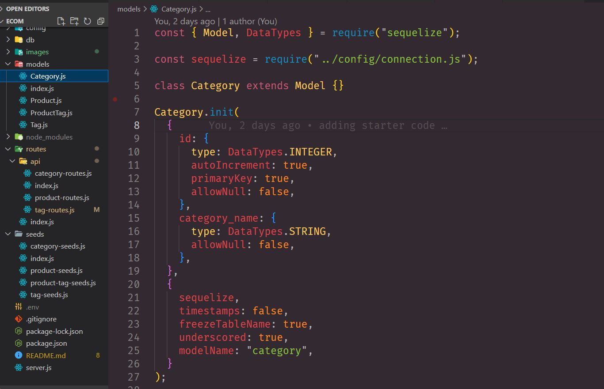
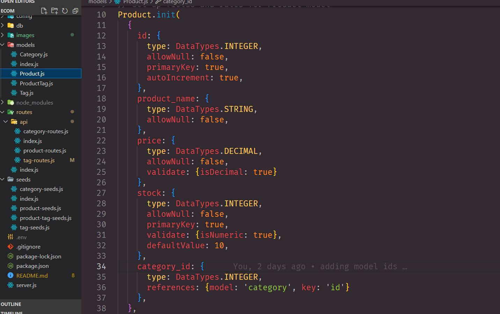
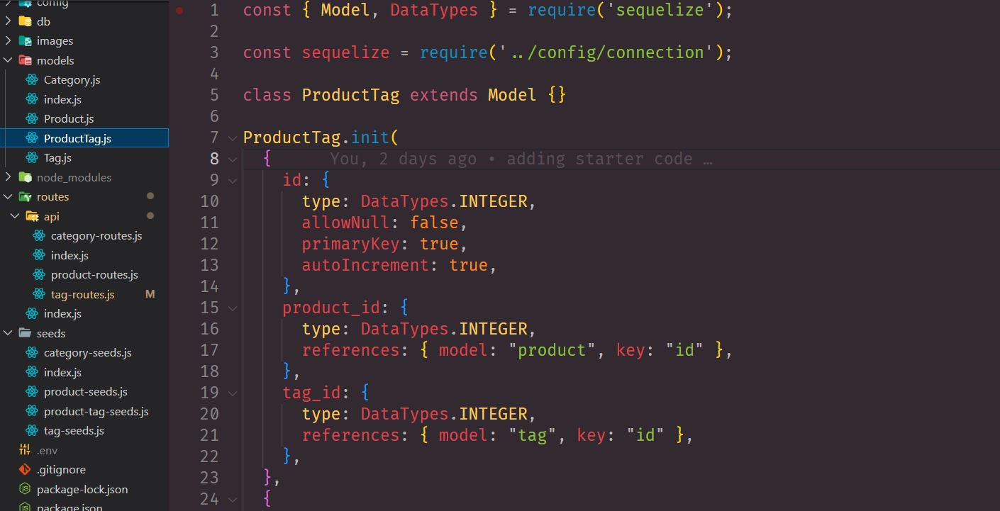
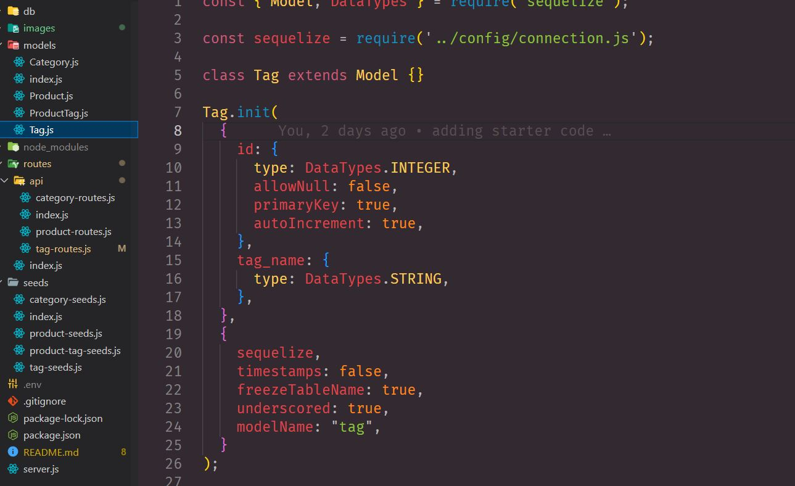

# E-Commerce

## _Table Of Contents_

1. [Description](#description)
2. [Usage](#usage)
3. [Installation](#installation)
4. [License](#license)
5. [Criteria For Assignment](#criteria-for-assignment)
6. [Repo Link](#repository-link)
7. [Walkthrough Video](#walkthrough-video)
8. [Screen Shots](#screen-shots)

## Description

For this assignment I was tasked with building the back end of an e-commerce website. I will be taking a working express.js API and alter it to be able to interact with sequelize and MYSQL database. I will be testing in the insomnia application once it is linked to MYSQL so the information is seeded onto my table.While testing in insomnia I will be able to convey how I can retreive the information for categories, tags and products with the GET method. I will also show how you can create, update and delete from categories, tags and products by using the put, post and delete methods in insomnia. 

## Usage

With this application the user will be able to get information on products, their categories and the tags they id with. The user will be able to also add new products which will create a new id with them. The user can delete products off of the seed data as well.

## Installation

You will need to install node packages including MYSQL2, sequelize and dotenv after cloning the repo.

## License

MIT

_Website for license_

[MIT License Website](https://mit-license.org/)

## Criteria-for-assignment

GIVEN a functional Express.js API

*WHEN I add my database name, MySQL username, and MySQL password to an environment variable file.*
**THEN I am able to connect to a database using Sequelize**

*WHEN I enter schema and seed commands*
**THEN a development database is created and is seeded with test data**

*WHEN I enter the command to invoke the application*
**THEN my server is started and the Sequelize models are synced to the MySQL database**

*WHEN I open API GET routes in Insomnia Core for categories, products, or tags*
**THEN the data for each of these routes is displayed in a formatted JSON**

*WHEN I test API POST, PUT, and DELETE routes in Insomnia Core*
**THEN I am able to successfully create, update, and delete data in my database**

## Repository-Link

[Github](https://github.com/PintoDrop/ecom)

## Walkthrough-Video

[Walkthrough Video]()

## Screen-Shots

<!-- 
Need put (good?) & delete (good?) for category

check models index.js for relations

 post/create/put/delete for products routes
 post/put/delete for tag routes
 -->